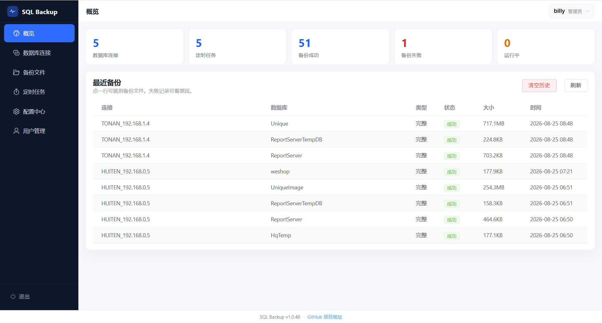
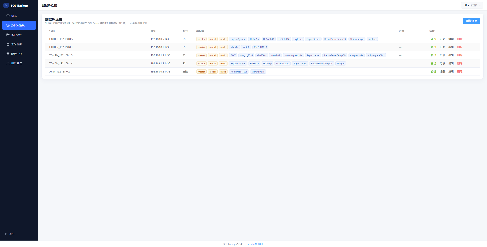
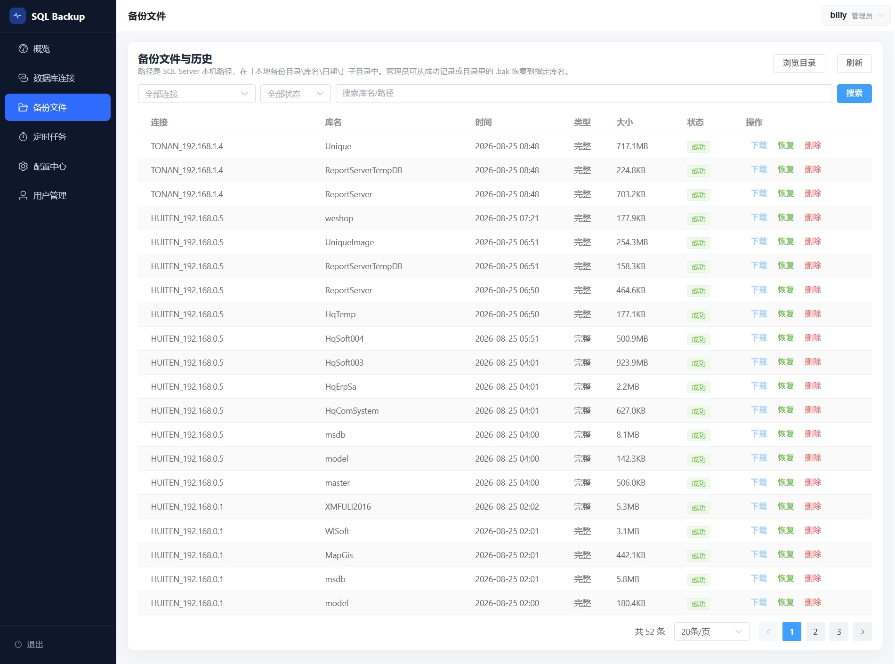
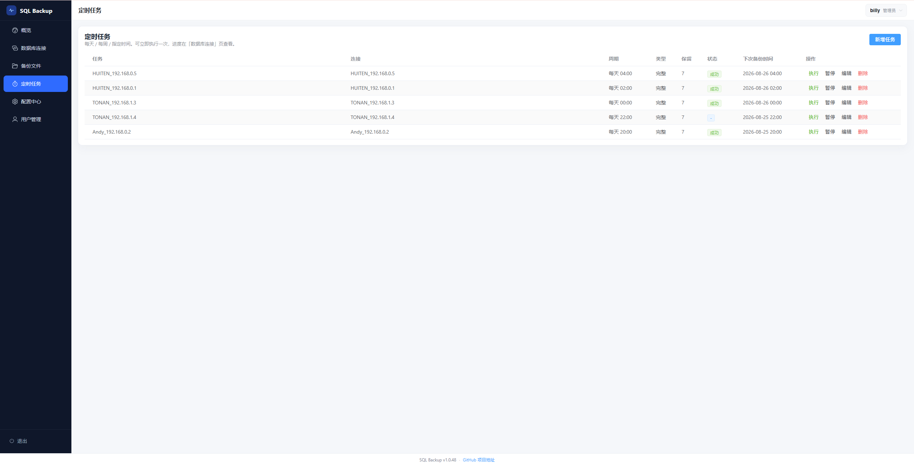
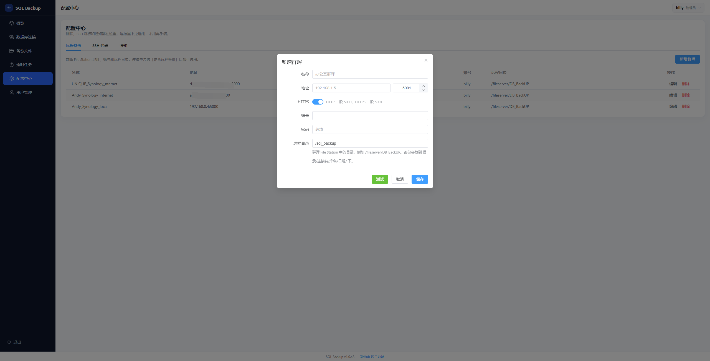
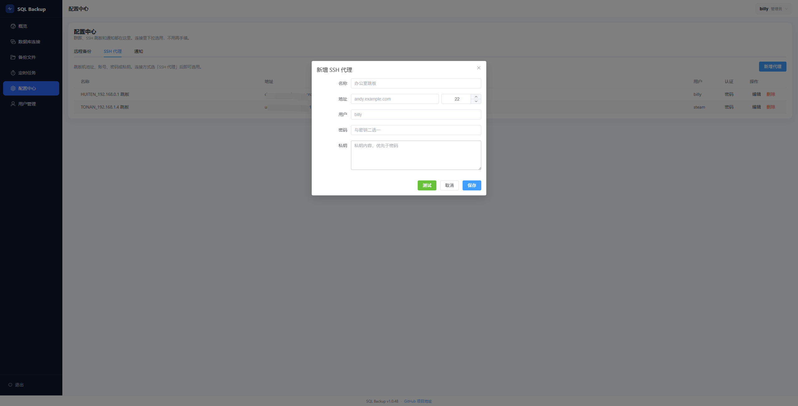
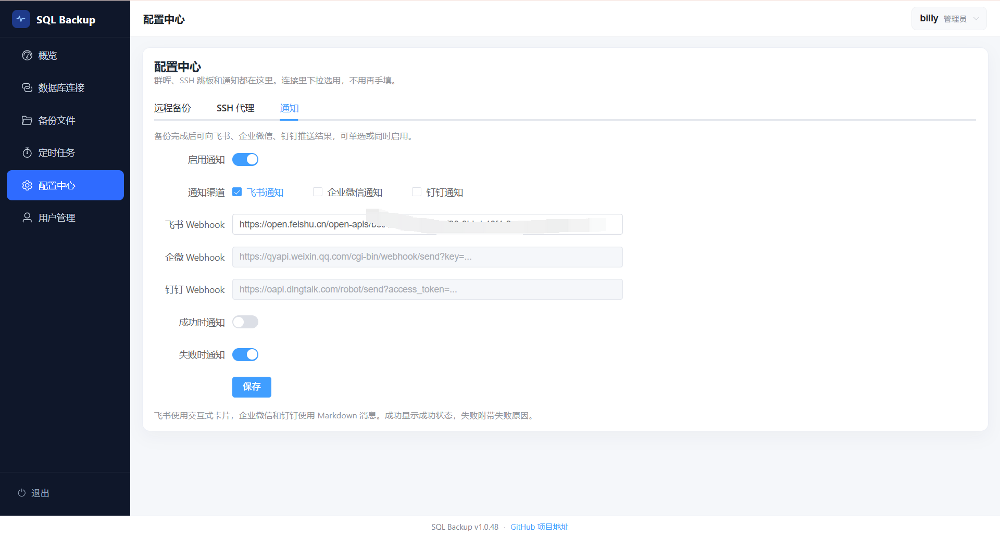
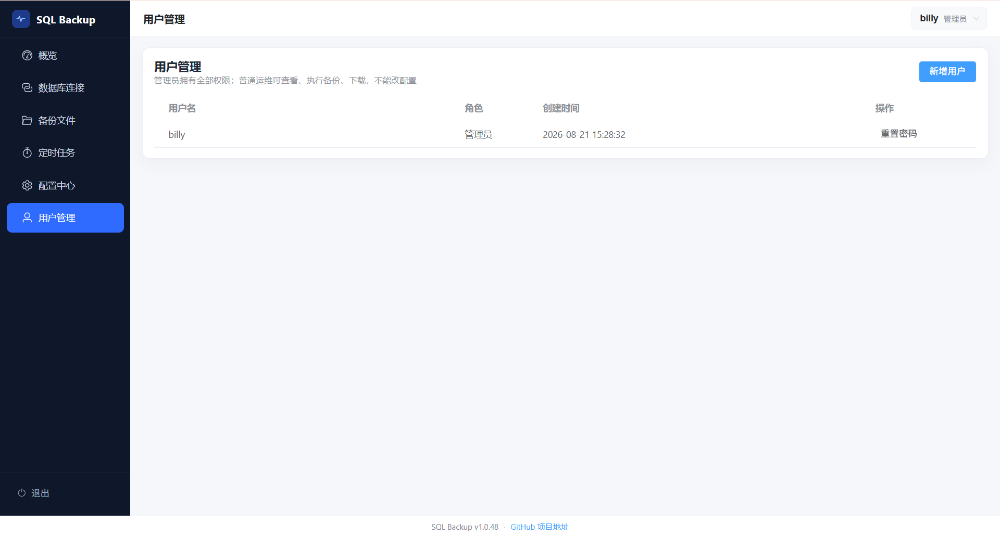

# SQL Backup

SQL Server 备份管理平台。平台可部署在任意机器；`.bak` 写在 **SQL Server 所在服务器**，不是本平台。

- 源码：https://github.com/billy-shang/sql-backup
- 镜像：https://hub.docker.com/r/billyshang/sql-backup （当前 `v1.0.51`）

## 功能

- 配置中心：远程备份（群晖）、SSH 代理、通知；连接里下拉选用
- 多实例连接（直连 / SSH），完整 / 差异 / 日志备份
- 定时任务、保留策略、群晖 File Station 远程归档
- 恢复向导：从完整备份恢复到指定库名（可覆盖）
- WebHook 通知：飞书 / 企业微信 / 钉钉（可单选或同时启用）
- 管理员 / 普通运维

备份路径：`{目录}\{库名}\{YYYY-MM-DD}\{库名}_{时间}_{类型}.bak`  

## 界面

<p align="center">
  <strong>登录</strong><br/>
  
</p>

<table>
  <tr>
    <td align="center" width="50%"><strong>概览</strong><br/></td>
    <td align="center" width="50%"><strong>数据库连接</strong><br/></td>
  </tr>
  <tr>
    <td align="center" width="50%"><strong>备份文件</strong><br/></td>
    <td align="center" width="50%"><strong>定时任务</strong><br/></td>
  </tr>
  <tr>
    <td align="center" width="50%"><strong>配置中心 · 远程备份（群晖）</strong><br/></td>
    <td align="center" width="50%"><strong>配置中心 · SSH 代理</strong><br/></td>
  </tr>
  <tr>
    <td align="center" width="50%"><strong>配置中心 · 通知</strong><br/></td>
    <td align="center" width="50%"><strong>用户管理</strong><br/></td>
  </tr>
</table>

## 运行

```bash
pip install -r requirements.txt
python -m app
```

打开 http://127.0.0.1:8788 ，默认 `admin` / `admin@123`

## 群晖上传

Windows 上的 `.bak` 优先由 **SQL Server 本机直传群晖**（PowerShell 2 兼容脚本 + curl / HttpWebRequest 流式上传）。SQL 机要能访问群晖 File Station（HTTP 5000 / HTTPS 5001）。大于 32MB 的文件直传失败不会再改走平台分块中转。

v1.0.51：修好 `_sql_temp_enable` 把真实错误盖成 `generator didn't stop after throw()` 的问题；上传脚本不再依赖 `Invoke-RestMethod`（PowerShell 3+），旧版 Windows 上的大库（如 Manufacture）才能直传。

进度条在归档阶段会显示「正在上传群晖 库名 xxMB」。最后一个库仍可能停在约 98%，等群晖列出现路径即结束。

## Docker 部署

```bash
docker pull billyshang/sql-backup:v1.0.51
docker run -d --name sql-backup --restart unless-stopped \
  -p 8788:8788 -e TZ=Asia/Shanghai -e SQL_BACKUP_DATA_DIR=/data \
  -v "$PWD/data:/data" billyshang/sql-backup:v1.0.51
```


